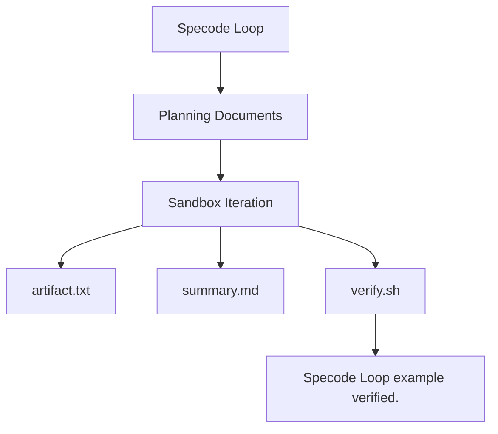

## Problem Statement

Specode Loop needs a realistic target project for manual demos and real e2e
tests. A tiny one-line fixture proves that a sandbox can write a file, but it
does not prove that a Sandbox Iteration can build on prior work, update a
structured Planning Document, and leave behind verifiable project behavior.

The example Target Project should be small enough for a fast real e2e run, but
it should look like the PRD documents used by this repository's planning
workflow.

## Solution

Provide a deterministic example Target Project whose `prd.md` follows the
standard PRD shape and whose `plan.md` is a tracer-bullet plan. Specode Loop
will run one Sandbox Iteration per unchecked phase. The finished project will
contain an artifact file, a derived summary, and an executable verification
script that proves the completed behavior from outside the implementation
details.

## User Stories

1. As a Specode Loop maintainer, I want the example PRD to use the normal PRD
   structure, so that e2e tests exercise realistic Planning Documents.
2. As a Specode Loop maintainer, I want the plan to contain multiple dependent
   phases, so that repeated Sandbox Iterations prove state carries forward
   correctly.
3. As a Specode Loop maintainer, I want the finished fixture to have exact file
   contents, so that the e2e assertions are deterministic.
4. As a Specode Loop maintainer, I want a verification command in the Target
   Project, so that the final state can be checked through an external behavior
   seam.
5. As a Specode Loop user, I want the demo project to remain tiny, so that I can
   understand the runner behavior without reading application code.
6. As a Specode Loop user, I want the demo project to avoid commits and external
   services, so that sandboxed work stays local and predictable.

## Implementation Decisions

- The Target Project uses root-level `prd.md` and `plan.md`, matching Specode
  Loop's required Planning Documents.
- The implementation surface is plain files and a shell verification command,
  keeping the fixture deterministic across host machines and sandboxes.
- The artifact file is built in the first phase so later Sandbox Iterations
  depend on earlier work.
- The summary file is derived from the artifact content, exercising a second
  project file instead of only appending to one file.
- The verification script is executable and checks externally visible behavior:
  exact file contents and success output.
- Runner-managed `.agents/skills/specode-do-work` files are out of scope for
  task work.
- Git commits are not part of this fixture.

## Module And Interface Diagram

## Testing Decisions

- The highest useful seam is the real Specode Loop command running against a
  copied Target Project.
- Tests should assert external behavior: final file contents, executable
  verification output, completed plan checkboxes, copied workflow skill
  presence, and exact Success Sentinel evidence in the project log.
- Tests should not inspect how sandboxed Codex creates the files.
- The fake-sandbox regression harness remains responsible for runner edge cases
  that do not require a real Docker Sandbox.

## Out of Scope

- Network access, dependency installation, package managers, and external
  services.
- Git commits or pull request creation.
- Application frameworks, databases, APIs, or browser UI.
- Modifying runner-managed workflow skill files.

## Further Notes

This fixture intentionally stays boring. Its job is to make each phase-level
Sandbox Iteration observable and deterministic while keeping the Planning
Documents close to the PRD and tracer-bullet plan style used for real work in
this repository.
