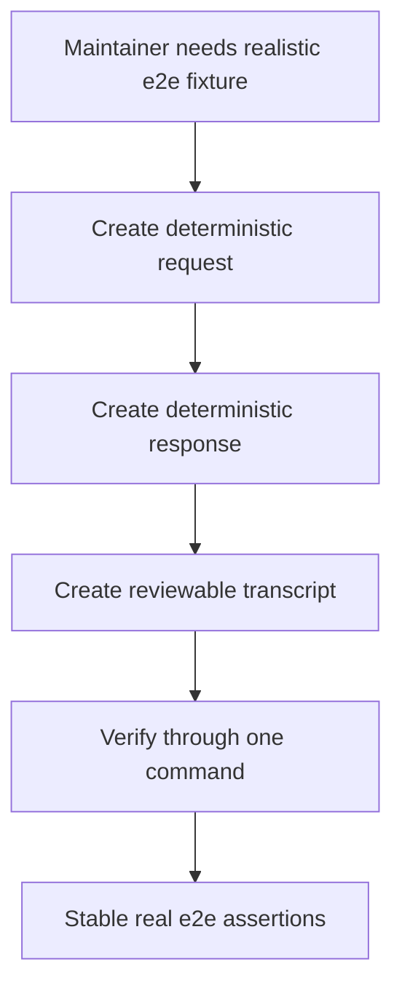
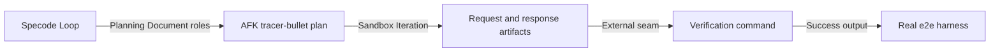

## Problem Statement

Specode Loop needs a small but realistic Target Project for demos and real e2e
tests. A one-file fixture proves that a Sandbox Iteration can write text, but it
does not prove that Codex can follow Planning Documents across multiple
dependent AFK phases, carry request context forward, produce a response, and
leave behind behavior that can be checked from outside the implementation.

The example must stay simple enough for reliable real Codex execution while
still resembling the PRD documents and tracer-bullet plans used for normal
Specode Loop work.

## Solution

Provide a deterministic request/response example Target Project. The PRD uses
the standard planning shape, and the plan contains four AFK tracer-bullet phases.
Each Sandbox Iteration completes one narrow request/response slice and marks only
that phase done. The finished Target Project contains a request artifact, a
response artifact, a reviewable transcript, and an executable verification
command that proves the final behavior through a single external seam.

## User Stories

1. As a Specode Loop maintainer, I want the example PRD to use the standard PRD
   structure, so that the real e2e path exercises realistic Planning Documents.
2. As a Specode Loop maintainer, I want the plan to contain four dependent AFK
   phases, so that repeated Sandbox Iterations prove state carries forward
   across more than a single task.
3. As a Specode Loop maintainer, I want the example to model a request and a
   response, so that integration tests verify a realistic interaction instead of
   only checking arbitrary file creation.
4. As a Specode Loop maintainer, I want every generated artifact to have exact
   deterministic contents, so that real e2e assertions can be stable.
5. As a Specode Loop maintainer, I want a final executable verification command,
   so that the completed Target Project can be checked through external
   behavior rather than implementation details.
6. As a Specode Loop user, I want the demo project to remain tiny, so that I can
   understand the runner behavior without reading application code.
7. As a Specode Loop user, I want the demo project to avoid package managers,
   network access, databases, and external services, so that sandboxed work stays
   local and predictable.
8. As a Specode Loop user, I want each phase to be independently understandable,
   so that the project log and plan checkboxes explain what happened during each
   Sandbox Iteration.
9. As a real e2e test maintainer, I want the fixture to expose a single
   verification seam, so that the test can assert finished behavior without
   depending on how Codex implemented the files.
10. As a real e2e test maintainer, I want runner-managed workflow skill files to
    remain untouched, so that task work does not modify Specode Loop-owned
    configuration.

## Implementation Decisions

- The Target Project uses conventional root-level Planning Document roles with
  default filenames.
- The request/response example is represented by plain text artifacts and a
  shell verification command.
- The first phase creates the request contract, and every later phase depends on
  that request context.
- The response is deterministic and intentionally short, making it suitable for
  real Codex execution and exact e2e assertions.
- The transcript combines the request and response into a human-reviewable
  artifact without introducing application framework code.
- The verification command is the external behavior seam for final checks.
- Runner-managed bundled workflow skill files are out of scope for task work.
- Git commits, package installation, and network services are not part of this
  fixture.

## Review Map

User-story cluster:

Module/interface sketch:

Interface: Request artifact, stories 3, 4, 8

- `{request_id, string}`: required; stable identifier shared by generated
  artifacts.
- `{user_request, string}`: required; natural-language request that the response
  answers.
- `{expected_response_kind, string}`: required; names the deterministic response
  contract.

Interface: Response artifact, stories 3, 4, 8

- `{response_id, string}`: required; must match the request identifier.
- `{status, string}`: required; expected to be `complete` for this fixture.
- `{summary, string}`: required; deterministic answer to the request.

Interface: Verification command, stories 5, 9

- `{exit_status, integer}`: required; `0` only when all artifacts match the
  expected contract.
- `{stdout, string}`: required on success; exact message used by real e2e
  assertions.

## Testing Decisions

- The highest useful seam is the real Specode Loop command running against a
  copied Target Project.
- Tests should assert external behavior: completed plan checkboxes, exact
  request/response/transcript contents, executable verification output, copied
  workflow skill presence, and Success Sentinel evidence in the project log.
- Tests should not inspect how sandboxed Codex chooses to create the artifacts or
  implement the verification command.
- The fake-sandbox regression suite remains responsible for runner edge cases
  that do not require a real Docker Sandbox.

## Out of Scope

- Network access, dependency installation, package managers, databases, APIs, and
  browser UI.
- Git commits or pull request creation.
- Any HITL phase that would prevent the real e2e harness from completing the
  example automatically.
- Modifying runner-managed workflow skill files.

## Further Notes

This fixture is intentionally small and literal. Its job is to make each
phase-level Sandbox Iteration observable, deterministic, and easy to verify while
keeping the Planning Documents close to the `to-prd` and `prd-to-plan` formats
used for real work in this repository.
